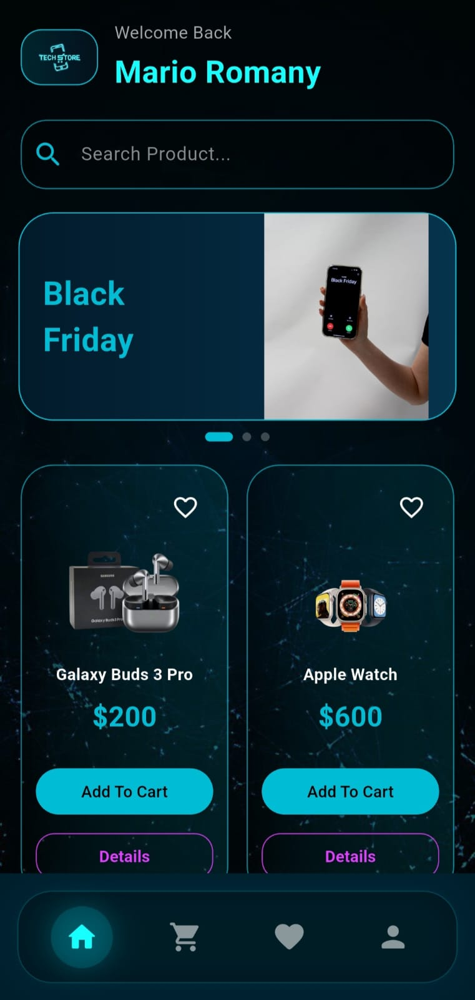
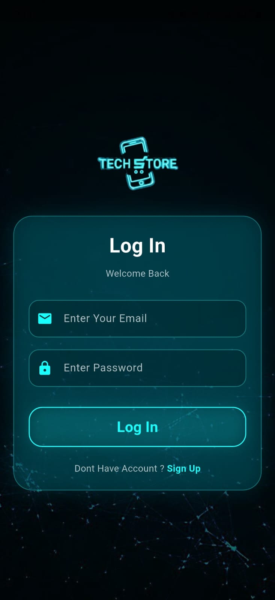
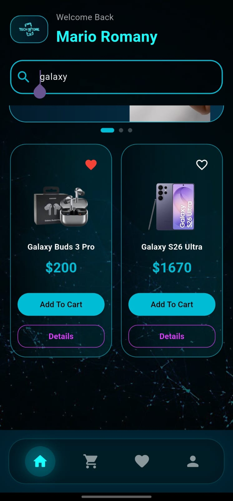
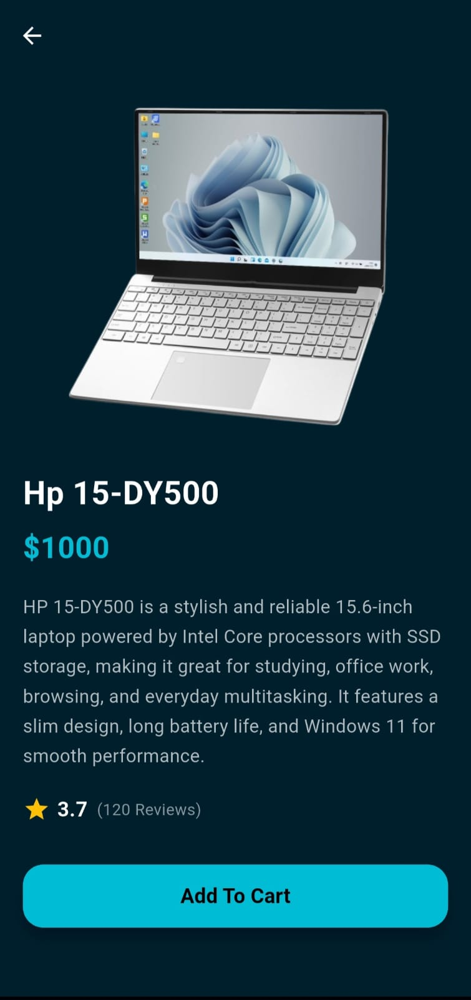
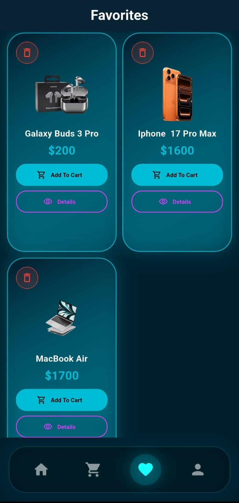
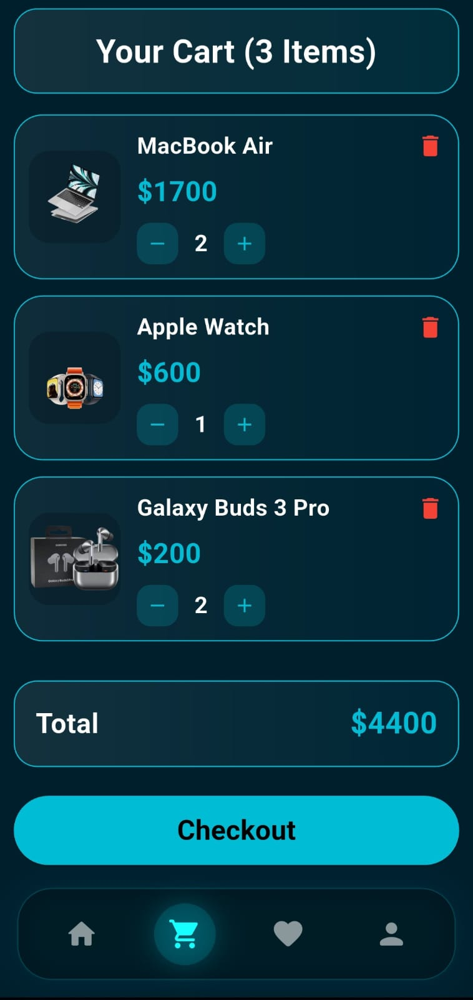
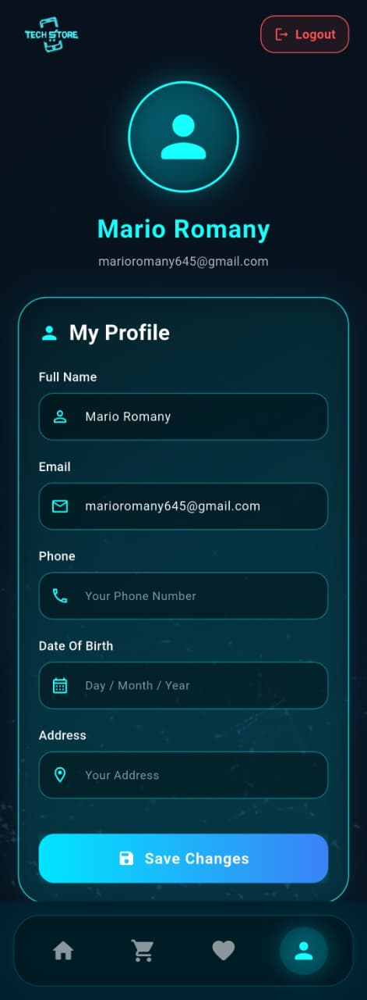

<h1 align="center">
🛍️ Tech Store
</h1>

<p align="center">
Modern E-Commerce Mobile Application built with Flutter & Firebase
</p>

<p align="center">


</p>

---

<p align="center">

</p>

---

# 📱 Overview

Tech Store is a modern Flutter E-Commerce application that provides a smooth shopping experience with a clean and responsive UI.

The application allows users to browse products, search items, manage favorites, add products to the cart, and securely authenticate using Firebase.

---

# ✨ Features

- 🔐 Firebase Authentication
- 🛒 Shopping Cart
- ❤️ Favorites
- 🔍 Smart Search
- 📦 Product Details
- 👤 User Profile
- ☁️ Cloud Firestore
- 📱 Responsive UI
- ⚡ Fast Performance
- 🎨 Modern Design

---

# 📸 Application Screens

<table>

<tr>

<td align="center">

### 🏠 Home



</td>

<td align="center">

### 🔐 Login



</td>

<td align="center">

### 🔍 Search



</td>

</tr>

<tr>

<td align="center">

### 📦 Product Details



</td>

<td align="center">

### ❤️ Favorites



</td>

<td align="center">

### 🛒 Cart



</td>

</tr>

<tr>

<td colspan="3" align="center">

### 👤 Profile



</td>

</tr>

</table>

---

# 🛠️ Tech Stack

- Flutter
- Dart
- Firebase Authentication
- Cloud Firestore
- REST API
- Provider
- Shared Preferences
- Material Design

---

# 📂 Project Structure

```text
lib/
│
├── models/
├── services/
├── screens/
├── widgets/
├── providers/
├── utils/
└── main.dart
```

---

# 🚀 Getting Started

### Clone Repository

```bash
git clone https://github.com/marioooo00/tech-store.git
```

### Go to Project

```bash
cd tech-store
```

### Install Packages

```bash
flutter pub get
```

### Run App

```bash
flutter run
```

---

# 🎯 Future Improvements

- 💳 Online Payment
- 🌙 Dark Mode
- ⭐ Product Reviews
- 🔔 Push Notifications
- 📦 Order Tracking
- ❤️ Wishlist Synchronization
- 🌍 Multi-language Support

---

# 👨‍💻 Developer

**Mario Romany**

Flutter Developer

📧 marioromany645@gmail.com

💼 LinkedIn

https://www.linkedin.com/in/mario-romany-865669299

🐙 GitHub

https://github.com/marioooo00

---

<div align="center">

### ⭐ If you like this project, don't forget to leave a Star ⭐

Made with ❤️ using Flutter

</div>
